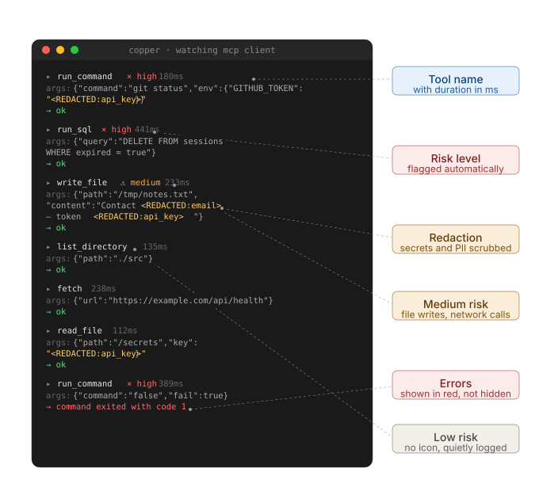

<div align="center">

# copper

**`tail -f` for AI agent tool calls.**

Wrap your MCP client with one line. Watch every tool call your agent makes scroll past your terminal in real time. Secrets get redacted. Risky calls get flagged. No server, no database, no dashboard — just a small CLI that does one thing well.

<br />



</div>

<br />

## Why

Building agents means watching them do things you didn't expect. Most of the time you find out by reading the result of a 12-step run after it's already finished — and by then the interesting moment has scrolled past in a wall of JSON. Copper prints each tool call as it happens, formatted to be readable at a glance, so you can see what's going on while it's going on.

It's the smallest possible answer to the question: "what is my agent actually doing right now?"

## Try it in five seconds

```bash
npx copper demo
```

That runs a fake agent firing off a handful of tool calls so you can see what the output looks like before wiring up your own.

## Install

```bash
npm install copper
```

## Use

```ts
import { Client } from "@modelcontextprotocol/sdk/client/index.js"
import { watch } from "copper"

const client = watch(new Client(/* ... */))

// use the client normally — every tool call gets logged
await client.callTool({
  name: "read_file",
  arguments: { path: "./README.md" },
})
```

That's the whole API. `watch()` wraps your existing MCP client and returns one with the same interface. Your agent code doesn't change. Tool calls appear on stdout as they execute.

## What you'll see

Each call prints as a small block:

```text
  ▸ write_file  ⚠ medium  127ms
    args: { path: "/tmp/notes.txt", content: "Meeting notes from <REDACTED:email>..." }
    → ok
```

Three things to notice:

- The arguments are redacted **before** anything renders. Secrets never leave your process.
- Risk indicators (`× high`, `⚠ medium`, no icon for low) appear next to calls based on what the tool does, not what it's called.
- Errors print in red with the failure reason inline — no need to scroll back to find what went wrong.

If stdout isn't a TTY (you're piping to a file, running in CI), colors and icons drop out so the output stays grep-friendly.

## Configuration

`watch()` takes an optional second argument:

```ts
watch(client, {
  stream: process.stderr,        // default: process.stdout
  redact: customRedactor,        // default: built-in patterns
  risk: customRiskScorer,        // default: built-in heuristics
})
```

The defaults are designed for the common case — MCP clients calling typical filesystem, shell, network, and database tools. Most people won't need to override anything.

## What gets redacted

Out of the box, copper scrubs:

- API keys (`sk-...`, `sk_live_...`, AWS access keys, GitHub tokens, Slack tokens)
- Email addresses
- Phone numbers
- Credit card numbers (Luhn-validated)
- High-entropy strings that look like secrets

Redaction runs recursively through the arguments object before anything is rendered or logged. Bring your own redactor if the defaults aren't enough — pass a function as `redact` and it receives the raw arguments, returns a redacted copy.

## What gets flagged as risky

A small heuristic scorer assigns each call a risk level based on the tool name and arguments:

- **High** — subprocess execution (`exec`, `run_command`, `shell`), destructive SQL (`DROP`, `DELETE`, `TRUNCATE`, `ALTER`), secret-adjacent reads
- **Medium** — file writes, deletes, network calls to non-allowlisted domains
- **Low** — reads, lookups, get-style calls

The scoring is intentionally simple. If you want something smarter, replace it entirely:

```ts
watch(client, {
  risk: (toolName, args) => {
    if (toolName === "deploy_to_prod") return { level: "high", score: 100 }
    return { level: "low", score: 0 }
  },
})
```

## What this isn't

- **Not an LLM tracing platform.** Copper doesn't see prompts or completions. It only knows about tool calls.
- **Not a hosted service.** There's no backend. Nothing phones home. The package runs entirely in your process.
- **Not a security tool.** Copper *observes*. It does not *enforce*. If a call is risky, copper flags it; it does not block it.

## Roadmap

- **v0.1** — current. MCP client wrapper, redaction, risk flags, terminal output.
- **v0.2** — adapters for other tool-calling SDKs, JSON output mode, persistent file logging.
- **Later** — maybe a small static HTML view if there's interest. Maybe nothing. This is a side project.

## Contributing

Issues and pull requests are welcome. The codebase is small enough to read in an afternoon — `src/` has six files, none over a few hundred lines.

Especially helpful first contributions:

- A redaction pattern that should be built in but isn't
- A tool name or argument shape that should score higher than it does
- A small example showing copper running with a real MCP server you use

If you're contributing for the first time, please read the [Code of Conduct](./CODE_OF_CONDUCT.md).

## License

MIT. See [LICENSE](./LICENSE).
